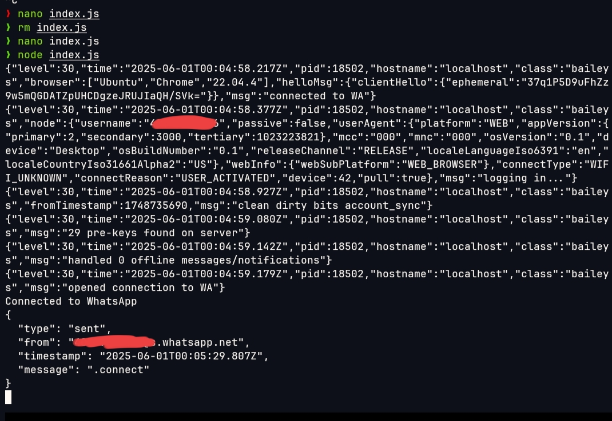

WhatsAppTracker


WhatsAppTracker is a Node.js tool for monitoring and logging WhatsApp Web activity. Designed to track online activity and add some automatization.

> Disclaimer: This tool is for ethical and legal use only. Do not use it for unauthorized tracking or surveillance.


---
# Features

Real-time WhatsApp Web monitoring

Timestamped logs of user activity

Keyword detection and highlighting

Optional file-based log saving

Modular code for easy extension


---

# Preview

WhatsApp WeB Logs Interface

	


---
# Installation:

# Requirements:

Node.js v14+

# Steps

 1. Clone the repository
    
```git clone https://github.com/nig-droid/WhatsAppTracker.git```

```cd WhatsAppTracker```

 2. Install dependencies
    
```npm install @whiskeysockets/baileys@6.7.18 puppeteer-core@24.9.0 qrcode-terminal@0.12.0```

 4. Start the application
    
```node index.js```


---

# Configuration

Edit config.json to customize behavior:

{
  "logToFile": true,
  "outputFile": "logs.txt",
  "monitorKeywords": ["urgent", "meeting", "project"]
}

logToFile: Enable/disable saving logs to a file

outputFile:logs.txt, morning_logs.txt

monitorKeywords: Track and highlight specific keywords


---

# Usage

1. Open WhatsApp on your phone, tap on the 3 dots, Linked devices


2. Scan the QR code to log in


3. Logs will appear in the terminal or your output file


> Optionally, modify index.js to suit your specific tracking needs


---

# Contributing

---Pull requests are welcome!---

# Fork it
Create a feature branch
```git checkout -b feature-name```

Commit changes
```git commit -m "Add feature"```

Push and open PR
```git push origin feature-name```


---

📄 License

This project is licensed under the MIT License.


---

# Acknowledgments

Node.js & Puppeteer for backend automation

Open-source community for the inspiration

---


